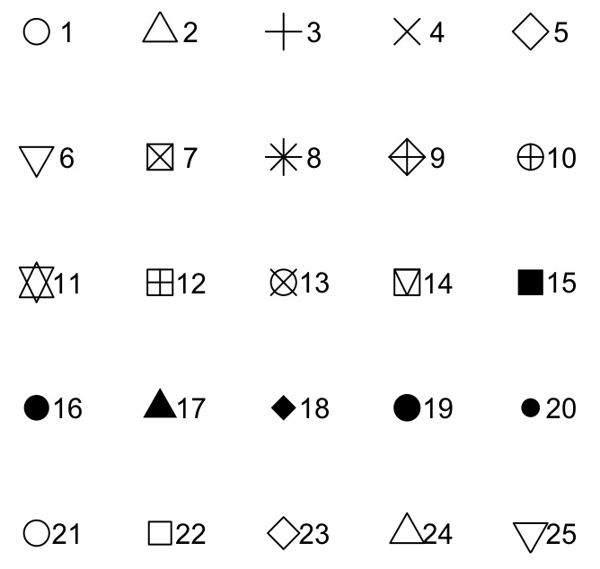

```{r, echo=FALSE}

library(knitr)
opts_chunk$set(comment="",  warning=FALSE)

```

Basic Plotting in R
===================

Types of Plots
--------------

* `hist`
* `boxplot`
* `barplot`
* `plot`

`hist`
-------

```{r, fig.width=7, fig.height=5}
hist(iris$Sepal.Length)
```

`boxplot`
------------

```{r}
boxplot(iris$Sepal.Length)
```

`barplot`
-------------

```{r, fig.width=6, fig.height=4}
library(psych)

length_stats <- describeBy(iris$Sepal.Length, iris$Species, mat=TRUE)

barplot(length_stats$mean, names=length_stats$group1)
```

`plot`
--------------

```{r, fig.width=7, fig.height=5}
plot(iris$Sepal.Length, iris$Sepal.Width)
```

General Plot Options
====================

Overview
--------

Additional Arguments

Adding Legends

Multiple Plots in the Same Window

Additional Arguments
--------------------

* `main` : title of plot
* `xlab`, `ylab`: title for x- or y-axis
* `col`: color
* `lwd`: line width
* `pch`: point character

Demonstrating with `plot`
-------------------------

```{r, fig.width=7, fig.height=5}
plot(iris$Sepal.Length, iris$Sepal.Width,
     main="Iris Data", xlab="Sepal Length", ylab="Sepal Width",
     col=iris$Species,
     lwd=2, pch=16)
```

What is that `pch` number?
---------------------------


Adding a Legend
----------------

```{r}
plot(iris$Sepal.Length, iris$Sepal.Width, col=iris$Species)
legend("topright", 
       legend=c('setosa', 'versico', 'virginica'), 
       col=1:3, pch=16)
```

Draw Plots in the Same Window
---------------------------------

The function `par` sets options for drawing plots.

Use `par(mfrow = c(ROW,COL))` to draw multiple plots.

To set it back to drawing a single plot, use `par(mfrow = c(1,1))`

Example of `mfrow`
------------------

```{r, fig.width=7, fig.height=5}
par(mfrow = c(2,2))
hist(iris$Sepal.Length)
boxplot(iris$Sepal.Length)
plot(iris$Sepal.Length, iris$Sepal.Width)
```

Setting Limits with `ylim` and `xlim`
=====================================

Example
--------

```{r}
plot(1:10, 1:10, ylim=c(5, 10), xlim=c(5,10))
```


Functions to Add to Plots
==========================

Overview
--------

* `lines`
* `points`
* `abline`
* `curve`
* `legend`

Adding lines
--------------

```{r, fig.width=7, fig.height=5}
plot(1:10, 1:10)
lines(1:10, 1:10, col='blue')
```

Adding points
-------------

```{r, fig.width=7, fig.height=5}
plot(1:10, 1:10, type='l')  # plot a line
points(1:10, 1:10, col='red')
```

Adding using abline
-------------------

```{r, fig.width=7, fig.height=5}
plot(1:10, 1:10)
abline(0, 1, col='green')   # abline(intercept, slope)
```

Histograms
==========

Overview of Options
-------------------

* breaks: number of bars to break data into
* border: border color

```{r}
hist(iris$Sepal.Length,
     breaks=40, border = 'blue', col='green')
```

More on Histograms
------------------

[R bloggers post](http://www.r-bloggers.com/basics-of-histograms/)
