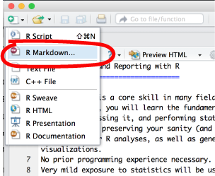

Data Analysis and Reporting with R
==================================

Data analysis is a core skill in many fields of research. 
In this course, you will learn the fundamentals of analyzing data with R: reading in data, processing it, and performing statistical analyses. 
In the name of preserving your sanity (and time), we put strong emphasis on organizing your R analyses, as well as generating meaningful reports and visualizations.
No prior programming experience necessary. 
Very mild exposure to statistics will be useful, but isn't necessary either.

**For simple, interactive lessons on some of the topics we'll cover, see [tryr.codeschool.com](http://tryr.codeschool.com)**

How to Use This Course
----------------------

[Download the zipped course materials here](https://github.com/machow/2016-rworkshop/archive/master.zip)

Believe it or not, everything used to create the pages of this site were done in R.
This was done using three tools:

1. **Rstudio** - an interface that makes working with R much easier.
2. **Rmarkdown** - a simple way to write a report that can be turned into a web page or pdf.
3. **R code** - the actual R part that does the data analysis

I'll walk you through getting the course materials, but in case you want to try beforehand there are instructions in [this clip](https://v.usetapes.com/53RibkfUIx).

Asking Questions
----------------

Feel free to contact me (machow@princeton.edu), or [raise an issue on github](https://github.com/machow/2016-rworkshop/issues/new).

Set Up
------

### Screencasts

In case you have trouble with installing R and Rstudio, these screencasts below will walk through the process.

* [Windows](https://v.usetapes.com/NkPfAN5oqb)
* [Mac](https://v.usetapes.com/rDOfGV0tT7)
* [Linux (Debian)](https://v.usetapes.com/nIEVMCLXMx)

### Install R, Rstudio, Rmarkdown

Go to [this site](https://cran.rstudio.com/) and download R by clicking the link corresponding to your operating system (shown below).


Once R is installed, [download and install Rstudio](https://www.rstudio.com/products/rstudio/download/). 
At this point, you should be able to open Rstudio, but check the screencasts above if you're not sure how.
Once you open Rstudio, it should look something like this the image below.


### Make sure it works

The following screenshots will walk you through testing that everything is ready to go. If it's not clear, here is a [very short screen cast of the process](https://v.usetapes.com/N96lrCj193). We'll explain what's happening in more detail during the workshop.

**Create an Rmarkdown document, and install the required packages:**




** Test generating a report **


** Profit **

When your report succesfully generates, you should something similar to the image below. We'll explain what each step of this process means during the course.


FAQ
----------------

As we go through the course, we will update this section based on questions that arise.

1. **I'm on Windows 10 and can't open Rstudio**  
Assuming you've installed Rstudio succesfully, look at [how to find apps in Windows 10](http://windows.microsoft.com/en-us/windows-10/getstarted-find-all-your-apps-and-programs).

2. **What is a working directory?**  [watch (1.5 mins)](https://v.usetapes.com/MeLR93hNHx)  
It's where R begins when looking for a file. So if I am in my `~/home` directory, and use the command `read.csv('a_file.csv')`, then R will look for the file in that directory. 

3. **What if my document won't knit?**  [watch (2 mins)](https://v.usetapes.com/T0Waq0pcUm)  
You should (1) set your working directory to where the document is, (2) clear your environment, (3) run all the chunks in your document to look for errors.
R normally stops knitting when it runs into errors.
However, putting the chunk below at the top of your document will print R errors in your report.
````
```{r}
library(knitr)
opts_chunk$set(error=TRUE)
```
````


