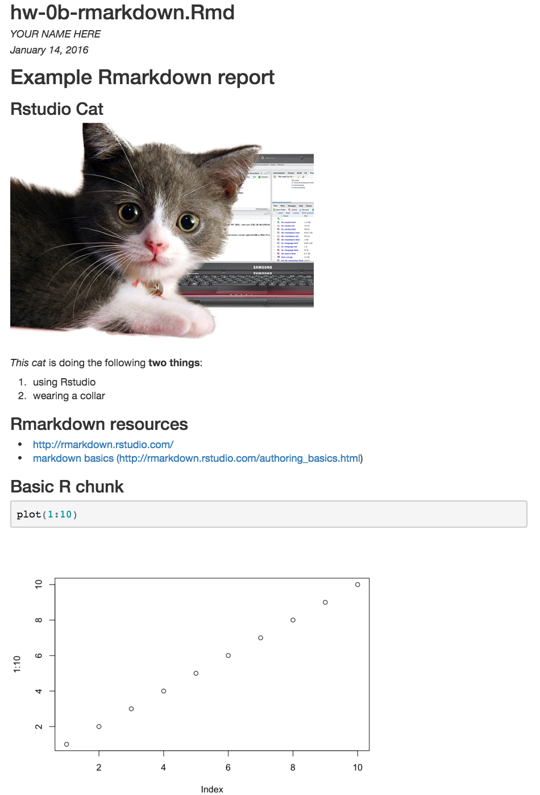

Example Rmarkdown report
========================

Rstudio Cat
-----------


*This cat* is doing the following **two things**:

1. using Rstudio
2. wearing a collar

Rmarkdown resources
-------------------------

* http://rmarkdown.rstudio.com/
* [markdown basics (http://rmarkdown.rstudio.com/authoring_basics.html)](http://rmarkdown.rstudio.com/authoring_basics.html)

Basic R chunk
-------------------------
```{r}
plot(1:10)
```


Problem (write this markdown document)
========================================

Make a new rmarkdown file, and recreate the document from the image below. (Feel free to use any photo of a cat from the internet.)

<div style="border: solid 1px;">

</div>