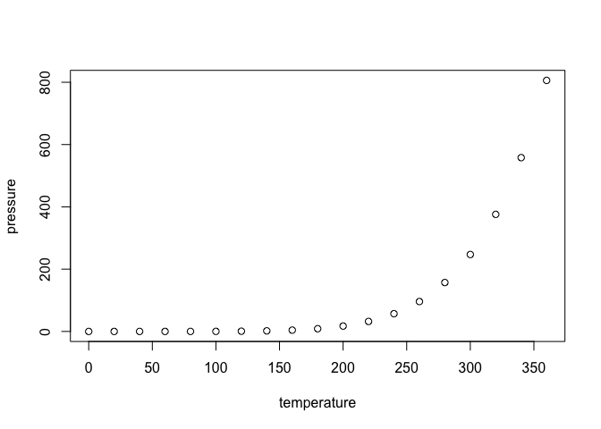

/usr/local/bin/pandoc +RTS -K512m -RTS index.md --to revealjs --from markdown\_strict+autolink\_bare\_uris+ascii\_identifiers+tex\_math\_single\_backslash-implicit\_figures --output index.html --smart --email-obfuscation none --self-contained --template pandoc\_revealjs.html --variable center=true --slide-level 2 --variable theme=simple --variable transition=slide --variable backgroundTransition=default --include-before-body ../.style/prefix.html --include-after-body ../.style/datacamp.html --mathjax --variable 'mathjax-url:<https://cdn.mathjax.org/mathjax/latest/MathJax.js?config=TeX-AMS-MML_HTMLorMML>' --variable revealjs-url=/Library/Frameworks/R.framework/Versions/3.2/Resources/library/revealjs/reveal.js-3.2.0 --no-highlight

A things

<code>a &lt;- 1</code>

R Markdown
----------

This is an R Markdown document. Markdown is a simple formatting syntax for authoring HTML, PDF, and MS Word documents. For more details on using R Markdown see <http://rmarkdown.rstudio.com>.

When you click the **Knit** button a document will be generated that includes both content as well as the output of any embedded R code chunks within the document. You can embed an R code chunk like this:

``` r
summary(cars)
```

    ##      speed           dist       
    ##  Min.   : 4.0   Min.   :  2.00  
    ##  1st Qu.:12.0   1st Qu.: 26.00  
    ##  Median :15.0   Median : 36.00  
    ##  Mean   :15.4   Mean   : 42.98  
    ##  3rd Qu.:19.0   3rd Qu.: 56.00  
    ##  Max.   :25.0   Max.   :120.00

Including Plots
---------------

You can also embed plots, for example:

<!-- -->

Note that the `echo = FALSE` parameter was added to the code chunk to prevent printing of the R code that generated the plot.
